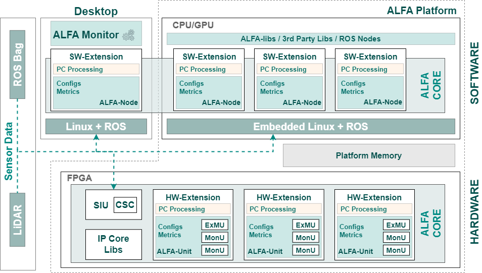

# ALFA - Advanced LiDAR Framework for Automotive

 ALFA is a tool designed for the development and evaluation of LiDAR data processing algorithms in various setups, with a special focus on embedded platforms with acceleration capabilities. ALFA enables seamless interfacing with a wide range of devices and sensors, facilitating the creation and deployment of hardware accelerators for processing point cloud data in diverse applications, such as weather denoising and ground segmentation.

## Architecture

### Software

 ALFA can be roughly split into two different domains: (1) <b>Desktop</b>, and the (2) <b>Embedded System</b>, divided between the <b>Software</b> and <b>Hardware Layers</b>. In the Software layer, all code runs on top of a Linux distribution with <a href="https://www.ros.org/">Robot Operating System 2 (ROS2)</a> support. The ALFA components follow a ROS2 configuration, which allows for an easy integration with other ROS-based software and 3rd-party Libraries, e.g., the <a href="https://pointclouds.org/">Point Cloud Library (PCL)</a>. The main software components of the framework are called <b>ALFA Extensions</b>, which is where developers can deploy point cloud processing algorithms, and are a built on top of the <b>ALFA Node</b>.

 <b>ALFA Node</b>  is a ROS-based node that supports the ALFA Extensions to facilitate the development of point cloud processing algorithms. The ALFA Node receives configurations through the ROS2 set parameters command (<b>ros2 param set &ltnode_name&gt &ltparameter_name&gt &ltvalue&gt</b>), outputs real-time metrics (<b>/NODE_NAME_metrics</b>) and publishes the processed point cloud data into a new <b>PointCloud2</b> ROS2 topic (<b>NODE_NAME_pointcloud</b>). The point cloud data can be retrieved from a real LiDAR sensor connected to the platform or from a public dataset thtough a ROS2 Bag (rosbag tool). Additionally, the Desktop version of the framework supports the <b>ALFA Monitor</b>, a GUI tool specially designed to configure the ALFA Extension, visualize point cloud data, and read real-time metrics from every ALFA Node running both in the Desktop and the Embedded System.
</a>

### Hardware

ALFA targets embedded hardware platforms with acceleration capabilities, enabling the deployment of custom accelerators in FPGA. For developing a hardware-based extension, it is necessary to deploy the ALFA-Unit. This component includes different hardware blocks, such as the (1) <b>Extension Management Unit (ExMU)</b>, (2) the <b>Monitor Unit (MonU)</b>, and the (3) <b>Memory Management Unit (MemMU)</b>. Everytime a new Extension is instantiated in the hardware, a new ALFA-Unit is required. Other hardware blocks available in the FPGA are the the <b>Sensor Interface Unit (SIU)</b>, several hardware-based <b>Libraries</b> used for point cloud processing, and a  <b>Coordinate System Converter (CSC)</b> block used for fast conversion between spherical and cartesian coordinates systems.
The communication between the Processing System (PS) and the Programmable Logic (PL) is done through standard AMBA communication buses, e.g., AXI, and through the DDR memory present in the platform.

The hardware blocks present in the ALFA Core are described as follows:

- 
 <b>ExMU:</b> Connects the Hardware Extension blocks and the ALFA-Unit. It provides a dedicate point cloud interface and a cache memory to store point cloud data.

- 
 <b>MonU:</b> Regists data of several monitoring points, used to trace the behavior of the hardware blocks, including Extensions. Such data can be visualized in the ALFA Monitor tool. 

- 
 <b>MemMU:</b> This block is responsible to manage any memory-related operations between the ALFA-Unit and the PS. the MemMU supports the management and storage of point clouds following different organizations and formats. It can interface both the on-chip DDR RAM and the available BRAM. 

- 
 <b>SIU:</b> Connects in hardware with the LiDAR to receive, decode, and reconstruct the point cloud data retrieved from the Ethernet Interface. Since it performs fast, it can support several and distinct sensors, at the same time. This module can deploy a custom point cloud data representation format, which can be used to represent any sensor data following the same structure. 

- 
 <b>Libs:</b> A set of generic algorithms and libs deployed in hardware, which have a corresponding version in software, that can be resorted by the Extensions according to their application. These libraries can include: range images conversion, data compression-related blocks, data structures (e.g., octrees), etc.

- 
 <b>CSC:</b> This block provides a fast conversion between the spherical and the cartesian coordinate systems. 

## ALFA Configurations

### Desktop

 This configuration provides the basic installation of ALFA, which consists of the ALFA Monitor, at least one ALFA Node, and at least one point cloud data. <b>This simple setup does not require any hardware platform </b> and can be used to test or deploy any point cloud processing algorithm. Thsi is also useful to test ALFA before aquiring a hardware platform. 

### Embedded Software

 This configuration provides the basic installation of ALFA on an embedded hardware platform. It can also interface a LiDAR sensor or retrieve the point cloud from a ROS Bag. However, the visualization can only be performed through the ALFA Monitor running on a Desktop system. This setup is usefull to test the deployment of algorithms and extensions on a real hardware plaform and retrieve performance metrics, before offloading the desired software modules to hardware. 

### Embedded Software-Hardware

 This setup provides the best trade-off between performance and hardware resources since it allows, in an embedded system, the deployment of hardware blocks to execute the most time-consuming tasks, usually performed by high performance processing systems. With this setup, the interface to the LiDAR sensor can be done through the onboard Ethernet port, where data can flow from the software driver to the Hardware Extensions, or by directly to a hardware-based Ethernet port, which allows for the SIU module to interface, read, decode, and process the received point cloud data. Such approach allows for extremelly high performance gains since all the processing is performed in hardware. 

## Repository Overview

The repository of the [ALFA Framework](https://github.com/alfa-project/alfa-framework) includes the following modules:

- [extensions](extensions/README.md) - Supported ALFA Extensions (sw-only, or both sw/hw).
- [node](node/README.md) - The source files of the ALFA Node.
- [drivers](drivers/README.md) - Contains the source files of the ALFA Drivers.
- [unit](unit/README.md) - Contains all hardware (verilog sources) of the ALFA Unit components.
- [platforms](platforms/README.md) - Contains the files of supported hardware platforms.
- [msgs](msgs/README.md) - ROS messages used by the ALFA framework.
- [libs](libs/README.md) - Compilation of hardware and software libraries to be used by Extensions
- [monitor](monitor/README.md) - The source files of the ALFA Monitor Tool.
- [meta-alfa](meta-alfa/README.md) - The ALFA layer for Yocto/Petalinux with the currently supported packages.

## Installation and user guides

 ALFA is composed of different components according to different features and functionalities. Currently supported installations: 

- To Install ALFA on a Linux-based Desktop system:
  - [x] Ubuntu 22.04.1 LTS with ROS 2 Humble Hawksbill ([**Setup guide**](docs/guides/alfa_install.md#desktop-ubuntu-22041-lts-with-ros-2-humble-hawksbill))
- To install ALFA on an Embedded platform:
  - [x] Xilinx Zynq UltraScale+ MPSoC ZCU104 (Petaliunx and Vivado) ([**Setup guide**](docs/guides/alfa_install.md#xilinx-zynq-ultrascale-mpsoc-zcu104))
  - [ ] More tools are going to be supported - TBA

There are also several user guides available to help you get started with ALFA:

- Monitor Tool User Guide ([**User guide**](docs/guides/monitor_user_guide.md))
- Extensions User Guide ([**User guide**](docs/guides/extensions_user_guide.md))

## References

[1] R. Roriz, J. Cabral and T. Gomes, ***"Automotive LiDAR Technology: A Survey,"*** in IEEE Transactions on Intelligent Transportation Systems, vol. 23, no. 7, pp. 6282-6297, July 2022, DOI: <https://doi.org/10.1109/TITS.2021.3086804>.

 <!---    @article{10.1109/TITS.2021.3086804,
     author={Roriz, Ricardo and Cabral, Jorge and Gomes, Tiago},
     journal={IEEE Transactions on Intelligent Transportation Systems}, 
     title={Automotive LiDAR Technology: A Survey}, 
     year={2022},
     volume={23},
     number={7},
     pages={6282-6297},
     doi={10.1109/TITS.2021.3086804}
    }
--->

[2] R. Roriz, A. Campos, S. Pinto and T. Gomes, ***"DIOR: A Hardware-Assisted Weather Denoising Solution for LiDAR Point Clouds,"*** in IEEE Sensors Journal, vol. 22, no. 2, pp. 1621-1628, 15 Jan.15, 2022, DOI: <https://doi.org/10.1109/JSEN.2021.3133873>.

 <!---      @article{10.1109/JSEN.2021.3133873,
        author={Roriz, Ricardo and Campos, André and Pinto, Sandro and Gomes, Tiago},
        journal={IEEE Sensors Journal}, 
        title={DIOR: A Hardware-Assisted Weather Denoising Solution for LiDAR Point Clouds}, 
        year={2022},
        volume={22},
        number={2},
        pages={1621-1628},
        doi={10.1109/JSEN.2021.3133873}
      }
--->

[3] L. Cunha, R. Roriz, S. Pinto and T. Gomes, ***"Hardware-Accelerated Data Decoding and Reconstruction for Automotive LiDAR Sensors,"*** in IEEE Transactions on Vehicular Technology, 2022, DOI: <https://doi.org/10.1109/TVT.2022.3223231>.

 <!---     @ARTICLE{10.1109/TVT.2022.3223231,
        author={Cunha, Luís and Roriz, Ricardo and Pinto, Sandro and Gomes, Tiago},
        journal={IEEE Transactions on Vehicular Technology}, 
        title={Hardware-Accelerated Data Decoding and Reconstruction for Automotive LiDAR Sensors}, 
        year={2022},
        volume={},
        number={},
        pages={1-10},
        doi={10.1109/TVT.2022.3223231}
      }
--->

[4] Gomes, T.; Matias, D.; Campos, A.; Cunha, L.; Roriz, R. ***"A Survey on Ground Segmentation Methods for Automotive LiDAR Sensors".***  Sensors 2023, 23, 601. <https://doi.org/10.3390/s23020601>

[5] Roriz, R.; Gomes, T. ***"An Embedded Framework for Automotive LiDAR Sensors".***  embedded world Exhibition&Conference 2023.

[6] Gomes, T.; Roriz, R.; Cunha, L.; Ganal, A.; Soares, N.; Araújo, T.; Monteiro, J. ***"Evaluation and testing system for automotive LiDAR sensors".***  Applied Sciences 12 (24), 13003. <https://doi.org/10.3390/app122413003>
