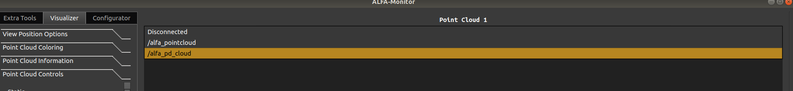

# ALFA-Monitor User Guide

## Table of Contents

- [ALFA-Monitor User Guide](#alfa-monitor-user-guide)
  - [Table of Contents](#table-of-contents)
  - [How to run the ALFA Monitor](#how-to-run-the-alfa-monitor)
  - [How to subscribe to a ROS Pointcloud2 topic](#how-to-subscribe-to-a-ros-pointcloud2-topic)
    - [Change Subscribed Topic](#change-subscribed-topic)
    - [Disconnect Topic](#disconnect-topic)
  - [Pause and Play Topic Data](#pause-and-play-topic-data)
  - [View Two Pointclouds Simultaneous](#view-two-pointclouds-simultaneous)
  - [Load and Store Pointcloud Frames](#load-and-store-pointcloud-frames)
  - [Load and Play ROS Bags](#load-and-play-ros-bags)
  - [Save Screenshots](#save-screenshots)
  - [Adjust, Sync and Save View Positions](#adjust-sync-and-save-view-positions)
  - [Output Pointclouds](#output-pointclouds)
  - [Visualize Node Metrics](#visualize-node-metrics)
  - [Configure Nodes](#configure-nodes)
  - [Pointcloud Information](#pointcloud-information)
  - [Connected Nodes](#connected-nodes)
  - [Box System](#box-system)

## How to run the ALFA Monitor

Run the ALFA Monitor tool:

```sh
ros2 run alfa_monitor alfa_monitor
```

## How to subscribe to a ROS Pointcloud2 topic

To make the ALFA-Monitor subscribe to a topic in the Pointcloud2 format, the user must click on the bar seen in the next image.


<p align="center">

</p>

Once clicked, a list containing all the possible connection topics will appear. This list is already filtered, and only compatible topics appear. After clicking on the desired topic, the ALFA-Monitor subscribes to that topic and starts receiving point clouds.



### Change Subscribed Topic

To change the pointcloud2 subscribed topic on the ALFA-Monitor, the user only needs to repeat the process of subscribing to a topic. Once the new topic is selected, ALFA-Monitor automatically changes the topic in which information is provided.

### Disconnect Topic

The disconnect process is similar to the subscribe one. The user clicks on the bar, but instead of selecting a topic, the user must select the option "Disconnected". Once clicked, the callback of the topic is destroyed, and ALFA-Monitor will not receive more point clouds from topics.


## Pause and Play Topic Data

ALFA-Monitor supports a pause and plays mechanism for the topic callback functionality. This can be used by interaction with the following buttons:


## View Two Pointclouds Simultaneous

ALFA-Monitors enable the user to observe up to two point clouds simultaneously. The second point cloud viewer can be enabled by checking the following checkbox.


The expected outcome from the previous operation should be something like this:


**Note**: Some operations like subscribing to topics can also be performed in the second point cloud viewer.

## Load and Store Pointcloud Frames

It is also possible to load and save static frames to the filesystem. The supported formats are .pcd and .ply. To use these functions, the user must use the buttons highlighted in the next image.


## Load and Play ROS Bags

ROS bags containing pointcloud2 topics can also be loaded to the tool. This can be done by interacting with the following buttons:

Once loaded, the user has different options to use. The user can move to the next frame, or the previous one. Additionally, the user can set to play the bag, at a defined frame rate. This frame rate can be set at any time. Once the bag finishes and the loop option is enabled, ALFA-Monitor will restart the bag.

**Note**: The loaded bag can only be displayed in the point cloud viewer 1.

## Save Screenshots

ALFA-Monitor allows the user to save screenshots of the current visualization pane in the point cloud viewer 1 to facilitate later analyses of the results obtained. This can be done by pressing the following button.


## Adjust, Sync and Save View Positions

To better manipulate the visualization environment, ALFA allows the following operations: (i) sync, (ii) reset, (iii) save, and (iv) load view points. When the user selects the sync option, the view position of the Point cloud 1 is applied to the Point cloud 2 viewer.  When the user selects the reset option, the view position returns to the state where the ALFA-Monitor started. The store/load option prompts the user to select a file to store/load the view position in a txt file.


## Output Pointclouds

The user can enable the ALFA-Monitor to output point clouds to a user defined topic. This can be done by clicking in the following checkbox:


Once enabled, all the new frames displayed in the Pointcloud viewer 1, will also be published on the topic named by the number 1 edit text. The user can also send a single frame, the one displayed in the Pointcloud viewer 1, by pressing the button in 2. The option higlited by the number 3 enables/disables pre processing of the point cloud before publishing it in the desired topic.


At this moment, ALFA-Monitor supports the injection and removal of points before the publishing. To alter the order of execution, the user must drag and drop the operation in the desired order.


## Visualize Node Metrics

ALFA-Monitor can receive and display data from other ROS nodes using the ALFA-MSG standard. This format comprises a name tag and a dynamic array of metric messages. These metric messages are composed of a metric name, the metric itself (float 32), and the units. Every topic available with this format is then displayed in the following tab, where the user can double-click on it, to subscribe to it.


Once double-clicked on a topic, a new window opens, where all the messages published in the topic will appear in the box labeled as 1. The user can then click on the desired metric, and then the information of that metric is displayed in the box labeled 2.


## Configure Nodes

ALFA-Monitor can configure ALFA nodes by performing a service call. This service is also an ALFA-MSG standard comprised of a configuration tag and a dynamic array of configuration messages. Additionally, this service returns the configuration status using an 8-bit integer. The available and compliant services are displayed in the following list, where the user can double-click on them to make a configuration call.


Once clicked, a window opens where the user can perform the configuration call. Firstly, ALFA-Monitor checks if the node has sent the default configurations, and if so, this configuration will be displayed in this window, on the box labeled by the number 3. However, if no configuration was sent by the node, then, ALFA-Monitor searches in the filesystem for a configuration file with the same name as the topic. If both searches fail, then this window will be blank, but the user can load from the file system some previously saved configuration by pressing the button labeled 2. In this note, the user can also save the configurations in the filesystem by pressing the button labeled 1. To add configuration to the list, the user can press the button labeled 5. To delete a configuration, first, the user must select the one to be deleted and then click on button 4. To edit a configuration, the user must select the configuration, and proceed with the modifications by using the box labeled 5. Finally, to send the configurations, the user must click on button 7.


## Pointcloud Information

To see the current point cloud display rate, as well as the number of points of the displaying point clouds, the user can go to the following tab.


## Connected Nodes

ALFA-Monitor keeps track of all the nodes that follow the designed architecture. If a node is active, the node name and type is shown. It is also possible to check if a node is active or inactive, as well as its current state. 


## Box System

The data related to a point or even the point cloud is shown in the following tab. Once in this tab, if the user shift+left clicks on a point, the information of that point will be displayed in the labeled box 1. Using the menu depicted as the labeled box 2, the user can add/delete boxes that assist with point cloud analysis and noise emulation. To add a new box the user clicks on the button "Add Box" and selects the size on the number dial. Then the user must click on the point cloud visualizer 1 in the desired area to deploy the box. Additionally, it is possible to save/load boxes from the filesystem to help test repeatability, which can be done in the labeled box 3. It is also possible to add noise and remove points from the point cloud. This is done using the placed boxes and depends on the box type, for example, when the "Add Noise" button is pressed, only the boxes labeled as "Noise Injector" will be used to add new points.


If the user doubles click on a box in the box list, the following window opens. In this window, the user can edit any settings related to the box selected. In the labeled box 1, the user selects the box type. The label boxes are used to calculate efficiency metrics like true positives.  The noise removal ones are used to delete the point inside the boxes. The noise injector ones are the location where random points will be injected.  The labeled box 2 is where the user can control the 3D dimensions and location of the selected box.


When the user clicks on the "Add Noise" button, the following window opens. In this window, the user can select the number of points to be injected into the point cloud, as well as the type of distribution. When using the gaussian noise, the parameters represent the standard deviation and the mean values of the gaussian distribution.

